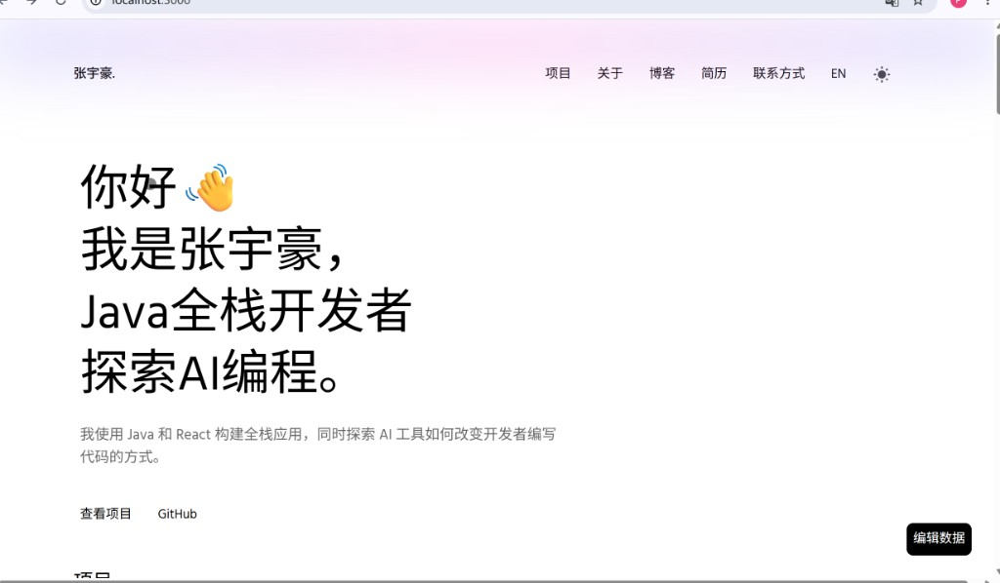

# React Portfolio Template

## 📌 项目介绍

这是一个基于 React 开发的个人作品集网站，用于展示个人项目、技术能力以及学习成果。  
项目支持响应式布局，可以在桌面端和移动端良好展示。

在该项目中，我对原始模板进行了去模板化改造，并结合个人实际项目（如 AI 数据分析 BI 系统）进行了内容重构，使其更贴近真实求职场景。

---

## 🛠 技术栈

- React
- JavaScript (ES6+)
- React Router
- CSS3 / Flex / Grid
- Next.js (Pages Router)
- Tailwind CSS
- GSAP (动画)
- Git / GitHub

---

## 📷 页面展示

### 首页



---

## 🚀 项目亮点

- **去模板化重构**：对原始模板进行了结构调整，使其更符合个人简历展示需求  
- **组件化设计**：页面拆分为多个可复用 React 组件，提高代码可维护性  
- **响应式布局优化**：适配不同屏幕尺寸，提升移动端访问体验  
- **国际化（i18n）**：支持中英文切换，基于 React Context + JSON 轻量实现  
- **SEO 优化**：完善 Open Graph、Twitter Card、Meta 标签，利用 Next.js SSG 预渲染  
- **数据驱动架构**：所有页面内容由 JSON 数据文件驱动，UI 与数据完全分离  

---

## 📂 运行方式

```bash
# 安装依赖
npm install

# 启动项目
npm run dev
```
